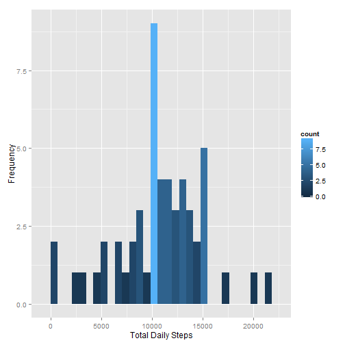
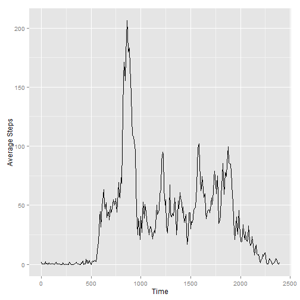
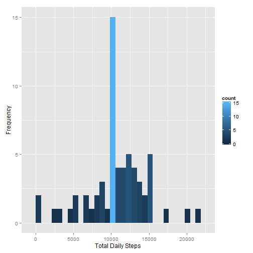
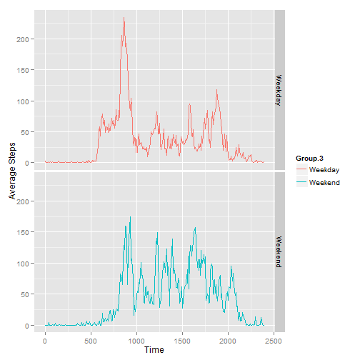

<h1>0. Initialize The Data</h1>

Here I:

- Read in the data
- Normalize the interval. Since it's a time in a decimal format, as is there are gaps between the end of an hour and the beginning of the next. I convert it to base 100 (so that 445 becomes 475)
- Add a vairable indicating whether or not a date is a weekday or weekend
- Add a match key to use when filling in the missing data
- Merge it all back with the original data source


```r
library(ggplot2)
the.data <- read.csv('C:/data/activity.csv', stringsAsFactors=FALSE)
the.data$date <- as.Date(the.data$date)
dec.interval <- round((floor(the.data$interval/100)*60 + (
  the.data$interval - floor(the.data$interval/100)*100))/0.6)
day.type <- weekdays(the.data$date)
day.type[grep("^S", day.type)] <- "Weekend"
day.type[day.type!="Weekend"] <- "Weekday"
match.key <- paste(day.type, the.data$interval, sep="")
the.data <- cbind(the.data, dec.interval, day.type, match.key)
```

<h1>1. What is mean total number of steps taken per day?</h1>


```r
grouped.data <- aggregate(the.data$steps[!is.na(the.data$steps)],
                          by=list(the.data$date[!is.na(the.data$steps)]),
                          FUN=sum)
qplot(x, data=grouped.data, xlab="Total Daily Steps",
      ylab="Frequency") + geom_histogram(aes(fill = ..count..))
```

```
## stat_bin: binwidth defaulted to range/30. Use 'binwidth = x' to adjust this.
## stat_bin: binwidth defaulted to range/30. Use 'binwidth = x' to adjust this.
```

 

The mean of total steps taken per day


```r
mean(grouped.data$x)
```

```
## [1] 10766.19
```

The median of total steps taken per day


```r
median(grouped.data$x)
```

```
## [1] 10765
```


<h1>2. What is the average daily activity pattern?</h1>


```r
interval.data <- aggregate(the.data$steps[!is.na(the.data$steps)],
                           by=list(the.data$dec.interval[!is.na(
                             the.data$steps)], the.data$interval[!is.na(
                               the.data$steps)]), FUN=mean)
qplot(Group.1, x, data=interval.data, geom=c("line"),
      xlab="Time", ylab="Average Steps")
```

 

The interval with the highest average steps


```r
max.steps <- interval.data$Group.2[interval.data$x==max(interval.data$x)]
paste(as.character(floor(max.steps/100)), ":", as.character(
  max.steps-floor(max.steps/100)*100), sep="")
```

```
## [1] "8:35"
```

<h1>3. Imputing missing values</h1>

Number of intervals with missing step values


```r
sum(is.na(the.data$steps))
```

```
## [1] 2304
```

Here I chose to match the missing values with the corresponding day type (weekend or weekday) and interval. For example a 8:45 weekday missing value would get the average value of a 8:45 weekday across all other values.


```r
day.type.data <- aggregate(the.data$steps[!is.na(the.data$steps)],
                           by=list(the.data$dec.interval[!is.na(
                             the.data$steps)], 
                             the.data$interval[!is.na(
                               the.data$steps)],
                             the.data$day.type[!is.na(
                               the.data$steps)],
                             the.data$match.key[!is.na(
                               the.data$steps)]), FUN=mean)
fixed.data <- merge(the.data, day.type.data, by.x="match.key",
                    by.y="Group.4")
fixed.data$steps[is.na(fixed.data$steps)] <- round(
  fixed.data$x[is.na(fixed.data$steps)])
grouped.fixed.data <- aggregate(fixed.data$steps,
                                by=list(fixed.data$date), FUN=sum)

qplot(x, data=grouped.fixed.data, xlab="Total Daily Steps",
      ylab="Frequency") + geom_histogram(aes(fill = ..count..))
```

```
## stat_bin: binwidth defaulted to range/30. Use 'binwidth = x' to adjust this.
## stat_bin: binwidth defaulted to range/30. Use 'binwidth = x' to adjust this.
```

 

The mean of total steps taken per day for the fixed data


```r
mean(grouped.fixed.data$x)
```

```
## [1] 10761.9
```

The median of total steps taken per day for the fixed data


```r
median(grouped.fixed.data$x)
```

```
## [1] 10571
```

<h1>4. Are there differences in activity patterns between weekdays and weekends?</h1>


```r
qplot(Group.1, x, data=day.type.data, geom=c("line"), xlab="Time", color=Group.3,
      ylab="Average Steps") + facet_grid(Group.3 ~ .)
```

 


